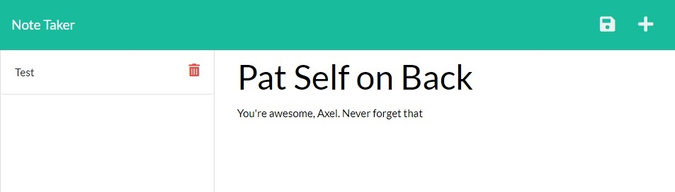

# Note Taker

## Description
A note-taking web app.

Click to view table of contents

## Table of Contents
* [Installation](#installation)
* [Usage](#usage)
* [Contributors](#contributors)
* [Questions](#questions)

## Installation
Head over to [uw-m11-note at Heroku](https://uw-m11-note.herokuapp.com/) to use.

## Usage

Type in a title and message in the main body. A save file icon should appear in the top-right, inside the nav bar. Saving the note will add it to the database (on the lefthand side).

Clicking on any of the notes in the database will let you view them in the main body. Click the "+" at the top-right of the screen to clear the main body if you wish to add another note.

Clicking the red trashcan on any note will delete it from the database.

## Contributors
- Axel, backend code
- Frontend code done by ???.

## Questions
If you have any questions, open an issue or contact directly at [axeljkern@yahoo.com](mailto:axeljkern@yahoo.com). You can find more of my work on [GitHub](https://www.github.com/Axeljk).